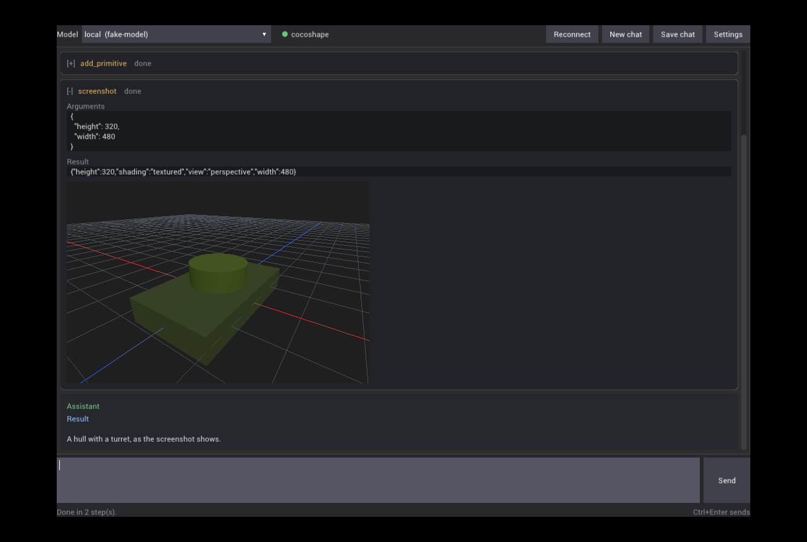

# mcpchat

Cliente de chat que liga um modelo de linguagem a **servidores MCP** ([Model Context Protocol](https://modelcontextprotocol.io)):
escreves o que queres, o modelo chama as *tools* dos servidores, vês cada chamada, o resultado e as imagens que
devolvem, e ele responde.

Programa nativo em C++17: janela da [zen_platform](https://github.com/akadjoker/zen_plataform) com OpenGL 3.3 e a
interface desenhada pelo [iGUI](https://github.com/akadjoker/iGUI). Um só executável, para Linux e Windows.



Não está preso a nenhum projeto: qualquer servidor MCP serve (o editor [CocoShape](https://github.com/akadjoker/cocoshape)
é um deles), e qualquer LLM com a API de chat da OpenAI (Ollama, LM Studio, vLLM, llama.cpp server, OpenAI, DeepSeek...)
ou com a Messages API da Anthropic (Claude).

```
tu ──► mcpchat ──(chat/completions ou Messages API)──► LLM (local ou remoto)
          │
          └──(MCP: HTTP ou stdio)──► servidor(es) MCP ──► o programa (editor, ficheiros, ...)
```

- **MCP:** Streamable HTTP (respostas JSON ou *event-stream*, sessão `Mcp-Session-Id`) e stdio (processo filho);
  handshake `initialize` nas revisões `2024-11-05` a `2025-11-25`; vários servidores ao mesmo tempo.
- **LLM:** dois protocolos, escolhidos por perfil — `chat/completions` com `tools` (DeepSeek, Ollama, OpenAI...) e a
  Messages API da Anthropic (`tool_use`/`tool_result`, Claude); ambos em *streaming* ou não, e o primeiro repete sem
  *streaming* se o servidor o recusar com tools. As imagens das tools vão para o modelo quando ele as vê, e as
  imagens que juntas à mensagem também (só para perfis com "Images").
- **Janela:** o texto do modelo aparece à medida que chega, com blocos de código; cada chamada de tool fica numa caixa
  que abre com os argumentos, o resultado e as imagens; botão Copy em cada mensagem; Stop cancela o pedido em curso;
  as conversas podem ser gravadas em JSON.
- **Rede:** libcurl em Linux, WinHTTP em Windows. Em Windows não precisa de nenhuma DLL além das do sistema.

## Compilar

Precisa de CMake 3.16+, um compilador C++17 e git (a zen_platform e o iGUI são descarregados pelo CMake, fixados num
commit).

```bash
# Linux (Debian/Ubuntu): zenity ou kdialog é só para o botão Attach
sudo apt install libx11-dev libxrandr-dev libgl-dev libcurl4-openssl-dev zenity
cmake -S . -B build -DCMAKE_BUILD_TYPE=Release
cmake --build build -j
./build/mcpchat

# Windows (Visual Studio)
cmake -S . -B build -A x64
cmake --build build --config Release

# Windows a partir de Linux (MinGW-w64, modelo de threads posix)
cmake -S . -B build-win -DCMAKE_TOOLCHAIN_FILE=cmake/mingw-w64.cmake -DCMAKE_BUILD_TYPE=Release
cmake --build build-win -j
```

`-DMCPCHAT_BUILD_GUI=OFF` compila só o núcleo e os testes (sem janela, sem zen_platform nem iGUI).

As versões prontas para Linux e Windows estão nas [releases](https://github.com/akadjoker/mcpchat/releases), feitas
pelo CI a cada tag `v*`.

## Usar

No primeiro arranque o mcpchat escreve duas configurações em `~/.config/mcpchat/` (Windows: `%APPDATA%\mcpchat\`):
`config.json`, com o CocoShape e cinco perfis (Ollama, LM Studio, OpenAI, DeepSeek e Claude), e `providers.json`,
com os provedores conhecidos e os modelos de cada um. Tudo se muda em **Settings**; os ficheiros também podem ser
editados à mão.

- Escreve na caixa de baixo e **Ctrl+Enter** (ou Send) envia; Enter muda de linha.
- **Attach** junta uma imagem à mensagem seguinte (também por `/attach <caminho>`, com o caminho entre aspas se tiver
  espaços; `/detach` tira-a). A imagem vai para o modelo como *part* `image_url` e o que escreveres ao lado é o
  pedido — por exemplo, ligado a um servidor MCP de modelação, "faz uma mesh parecida com esta". O caminho do
  ficheiro vai também no texto (`[attached image: ...]`), para o modelo o poder dar a uma tool que leia ficheiros;
  uma imagem colada da área de transferência é gravada na pasta temporária para ter um. Só perfis com
  **Images** ligado a recebem; nos outros a mensagem não é enviada e o texto e a imagem ficam à espera.
- A barra de cima escolhe o perfil (o LLM) e mostra cada servidor: verde ligado, vermelho não (passa o rato por cima
  para ver as tools ou o erro). **Reconnect** volta a ligar aos servidores.
- **New chat** começa de novo; **Save chat** grava a conversa em `conversations/` ao lado da configuração.
- A roda do rato, a barra lateral e PageUp/PageDown percorrem a conversa; enquanto estás no fundo, ela acompanha o
  texto novo.

## Configuração

```json
{
  "current_profile": "ollama",
  "confirm": "destructive",
  "servers": [
    {"name": "cocoshape", "url": "http://127.0.0.1:7420/mcp", "token_env": "COCOSHAPE_API_TOKEN"},
    {"name": "files", "command": "npx", "args": ["-y", "@modelcontextprotocol/server-filesystem", "/home/eu/modelos"]}
  ],
  "profiles": [
    {"name": "ollama", "base_url": "http://localhost:11434/v1", "model": "qwen2.5:14b"},
    {"name": "openai", "base_url": "https://api.openai.com/v1", "model": "gpt-6-astra",
     "api_key_env": "OPENAI_API_KEY", "vision": true},
    {"name": "deepseek", "api": "openai", "base_url": "https://api.deepseek.com/v1",
     "model": "deepseek-flash", "api_key_env": "DEEPSEEK_API_KEY"},
    {"name": "claude", "api": "anthropic", "base_url": "https://api.anthropic.com/v1",
     "model": "claude-sonnet-5-5", "api_key_env": "ANTHROPIC_API_KEY", "vision": true}
  ]
}
```

**Servidores** (`servers`): `url` para HTTP ou `command` + `args` (+ `env`) para stdio; `headers` extra;
`token_env` = nome da variável de ambiente com um token *Bearer*; `enabled`; `timeout` (segundos).
Com um servidor, o modelo vê os nomes das tools tal como são; com vários, `servidor__tool`.

**Perfis** (`profiles`, um LLM cada):

| Campo | Significado |
|---|---|
| `api` | `openai` (por omissão) para `chat/completions` — Ollama, LM Studio, vLLM, DeepSeek, OpenAI — ou `anthropic` para a Messages API do Claude |
| `base_url` | endereço, com o prefixo de versão (`http://localhost:11434/v1`, `https://api.anthropic.com/v1`); um endereço sem `/v1` também é aceite no Claude |
| `model` | nome do modelo no servidor |
| `api_key_env` | **nome** da variável de ambiente com a chave (a chave nunca vai para o ficheiro) |
| `vision` | o modelo aceita imagens; é dito por ti, não adivinhado ("Images" em Settings) |
| `simplify_schema` | simplifica os esquemas das tools para servidores que rejeitam `oneOf`, `minItems`... |
| `stream` | resposta em *streaming* |
| `temperature`, `max_steps` (40), `request_timeout` (300), `context_chars` (120000) | |
| `system_prompt` | substitui o *system prompt* genérico; as `instructions` de cada servidor são sempre juntadas |

**Confirmação** (`confirm`): antes de correr uma tool, a janela pergunta (Allow / Deny) conforme a política:
`destructive` (as que o servidor marca com `destructiveHint: true`), `writes` (todas as que não são só de leitura) ou
`never`.

**Chaves e tokens** vêm da variável de ambiente indicada; em alternativa escrevem-se em Settings ("Set") e ficam só em
memória enquanto o programa corre, nunca no ficheiro.

## Provedores conhecidos

Em **Settings → Model**, a combo **Provider** preenche o protocolo, o endereço e a variável da chave de um provedor
conhecido, e a combo **Model** oferece os modelos desse provedor — o campo ao lado aceita na mesma qualquer nome
escrito à mão (é o que precisas para um servidor local, cujos modelos só tu conheces).

A lista vem de `providers.json`, ao lado do `config.json`, escrito no primeiro arranque e editável:

```json
{
  "version": 1,
  "providers": [
    {"name": "DeepSeek", "api": "openai", "base_url": "https://api.deepseek.com/v1",
     "api_key_env": "DEEPSEEK_API_KEY", "models": ["deepseek-flash", "deepseek-v4-pro"]},
    {"name": "Anthropic (Claude)", "api": "anthropic", "base_url": "https://api.anthropic.com/v1",
     "api_key_env": "ANTHROPIC_API_KEY",
     "models": ["claude-opus-5-5", "claude-sonnet-5-5", "claude-fable-5-1", "claude-haiku-4-5-20251001"]}
  ]
}
```

Os modelos são nomes que os provedores mudam com frequência, e por isso vivem neste ficheiro e não no programa:
acrescenta os que quiseres, ou corrige-os quando um for substituído. Um ficheiro ilegível não impede o arranque — a
janela di-lo e usa a lista de origem. Ao escolher um provedor cujo modelo atual não serve, o perfil passa para o
primeiro da lista dele; o `Providers:` na aba **General** diz onde está o ficheiro.

## Com o CocoShape

```bash
cocoshape --api        # o editor, com MCP em http://127.0.0.1:7420/mcp
```

Com a configuração de exemplo o mcpchat liga-se logo a ele. O CocoShape manda as suas convenções (unidades, eixos,
como construir e verificar) nas `instructions` do MCP e o mcpchat junta-as ao *system prompt*. Para o modelo ver os
screenshots do editor, liga "Images" no perfil (só em modelos com visão). Modelos pequenos podem precisar de
"Simple schemas".

## Testes

```bash
ctest --test-dir build --output-on-failure        # servidores MCP e LLM falsos, sem rede
COCOSHAPE_BIN=/caminho/cocoshape xvfb-run -a ./build/tests/mcpchat_e2e   # contra o editor real
```

O CI corre os testes em Linux (também com AddressSanitizer e UBSan) e em Windows com MSVC, compila para Windows com
MinGW, corre o teste ponta a ponta contra o CocoShape e verifica que os executáveis Windows só importam DLLs do
sistema.

## Limites

- Do lado do LLM, dois protocolos: a API OpenAI-compatível (Ollama, LM Studio, vLLM, OpenAI, DeepSeek...) e a
  Messages API da Anthropic (Claude). Outras APIs entram como mais um `LlmProvider` em `src/llm/`.
- No Claude o `max_tokens` é obrigatório e está fixo em 8192: uma resposta é cortada aí.
- Do MCP usa só *tools* (não *resources*, *prompts* nem *sampling*).
- O texto usa uma fonte (Roboto) com os caracteres latinos e símbolos comuns; caracteres fora desse conjunto (CJK,
  emoji) não aparecem. Do markdown, os blocos de código e os títulos têm aspeto próprio e o negrito perde os `**`; o
  resto aparece como texto.
- Em Windows a escala da interface é 1:1 com os píxeis do ecrã.
- Arrastar um ficheiro para dentro da janela só funciona em Windows: o backend X11 da zen_platform ainda não fala
  XDND. Em Linux usa o botão **Attach** ou `/attach <caminho>`.
